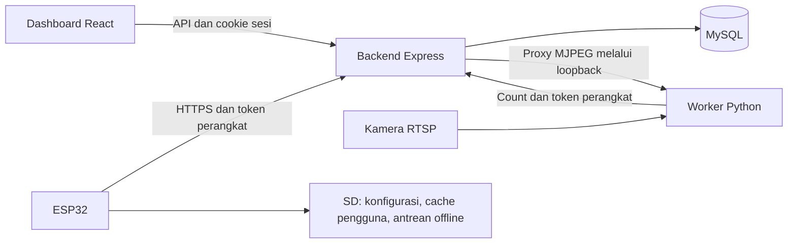

# Arsitektur dan alur data

## Komponen aktif

Saat development, Vite pada port 3000 mem-proxy `/api` ke backend port 5002. Saat production, reverse proxy HTTPS menyajikan `frontend/dist` dan meneruskan `/api` ke backend. Worker counting dan backend menggunakan loopback untuk MJPEG sehingga harus berada pada host/jaringan loopback yang sama pada konfigurasi saat ini.

## Identitas dan otorisasi

Browser login memakai SID dan password bcrypt. Akun baru memakai SID sebagai password awal dan dapat menggantinya dari profil. Server menyimpan hash token sesi di `web_sessions` dan memberikan cookie HttpOnly selama delapan jam. Frontend menyimpan token CSRF di memori dan mengirimkannya pada mutasi. Identitas dan role dipulihkan melalui `/api/users/me`; role terbaru dibaca dari database.

ESP32 dan counting menggunakan `X-Device-Token`. Hash token dipetakan ke satu boks. Middleware membatasi perangkat pada operasi dan identitas boks yang diizinkan. Token perangkat tidak diberikan ke browser. Aturan role berada di [authorization.js](../backend/middleware/authorization.js).

## Telemetri dan sesi

ESP32 mengirim `event_id` untuk deduplikasi. Backend mengunci baris boks dalam transaksi dan mencatat receipt di `device_events`; pengiriman ulang ID yang sama tidak menggandakan perubahan. Event langsung memperbarui snapshot boks, antrean pekerja, dan riwayat sesuai jenis event. Sesi dibuka pada `SUPERVISOR_LOCK_IN` dan ditutup oleh event logout/penutupan yang sesuai.

Replay offline dicatat tanpa menimpa snapshot langsung. Waktu penerimaan replay tidak membuktikan waktu kejadian aslinya. Jika asal sesi tidak diketahui, backend tidak mengarang kaitan sesi. Detail implementasi ada di [telemetryModel.js](../backend/models/telemetryModel.js).

## Perintah perangkat

Perintah menggunakan tabel `device_commands`, terpisah dari telemetri. API hanya menerima `SYNC_USERS`. ESP32 mengambil perintah, memperbarui cache, lalu ACK ID setelah berhasil. Perintah memiliki masa berlaku sepuluh menit; antrean dibatasi 20 perintah pending yang belum kedaluwarsa per boks. Tidak ada perintah remote untuk membuka relay.

## People counting dan tampilan

Python membaca RTSP, menjalankan deteksi, lalu mengirim jumlah orang ke API dengan identitas boks. Hasil terbaru disimpan pada `people_counting_latest`; riwayat sesi membutuhkan sesi yang diketahui. Data lebih tua dari 15 detik ditandai stale oleh backend. Data belum tersedia ditampilkan sebagai tidak diketahui, bukan nol.

MJPEG disajikan Python pada loopback dan diakses browser melalui endpoint backend yang memerlukan autentikasi. Pemetaan `MJPEG_PORTS` menentukan stream setiap boks secara eksplisit.

## Batas sistem

Tes lokal memakai database tiruan dan tidak membuktikan konsistensi perangkat fisik. Konkurensi firmware, kegagalan SD, pemulihan setelah listrik padam, serta perilaku relay perlu diuji. Lihat [audit production](PRODUCTION_AUDIT.md) sebelum menetapkan kesiapan operasional.
